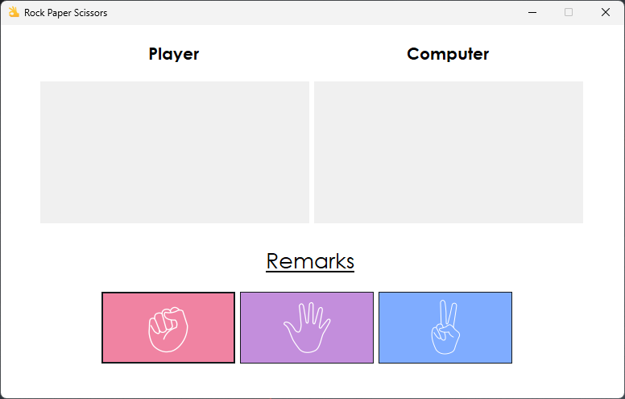
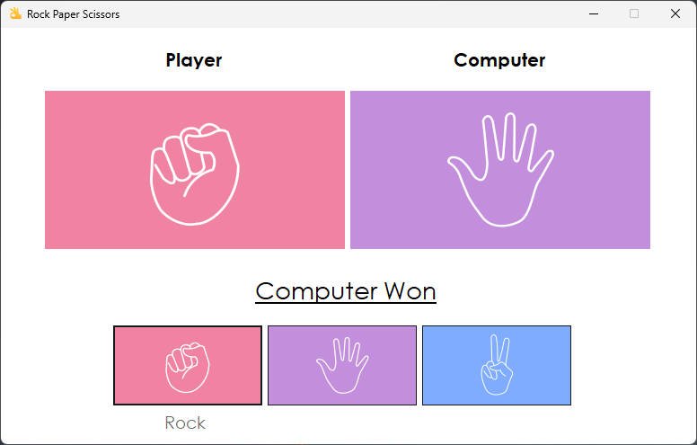
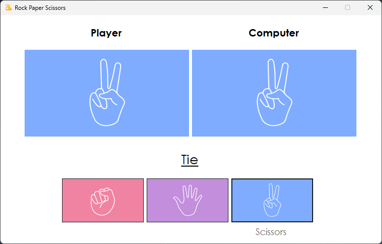

# Rock, Paper, Scissors Game✌️

[](https://opensource.org/licenses/MIT)

A simple rock, paper, scissors game implemented in C++ using .NET and WinForms.
### 
### 
### 
### 

## Getting Started🛹

### Prerequisites

To build and run this application, you need:

- [Visual Studio](https://visualstudio.microsoft.com/) with C++ and .NET development tools.

### Installation🔃

1. **Clone the repository:**

   ```bash
   https://github.com/ashish-shr/Rock-Paper-Scissors.git
   ```
1. **Open the project in Visual Studio:**

    - Open Visual Studio and choose "Open a project or solution." Navigate to the cloned repository and select the solution file (`.sln`).
    - Press `Ctrl` + `Shift` + `B` to build the solution, and then press `F5` to run the application.
